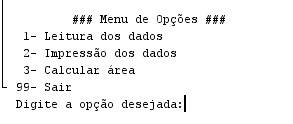

# Menu com Scanner

Implementação de exemplo que utiliza Scanner para construir um menu de opções.

## Contextualização

 - Esta é uma versão do sistema para a IDE NetBeans.  
 - O projeto no NetBeans deve ser chamado **menuscanner**. 

## Menu principal

